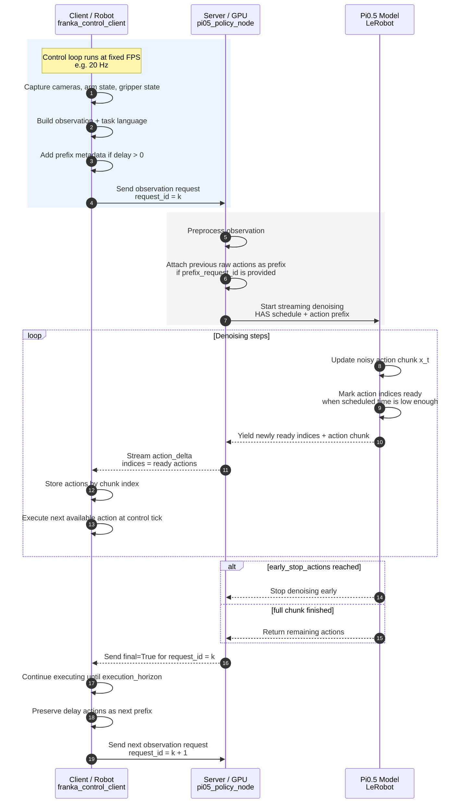
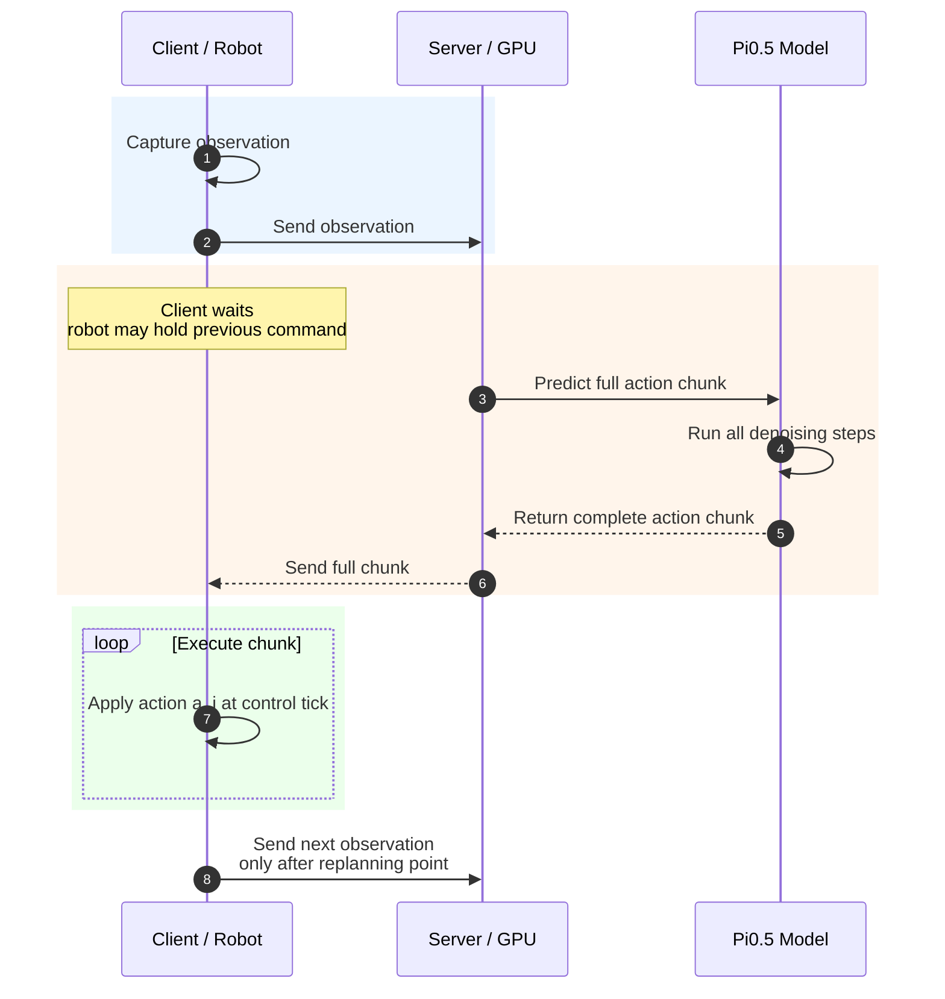
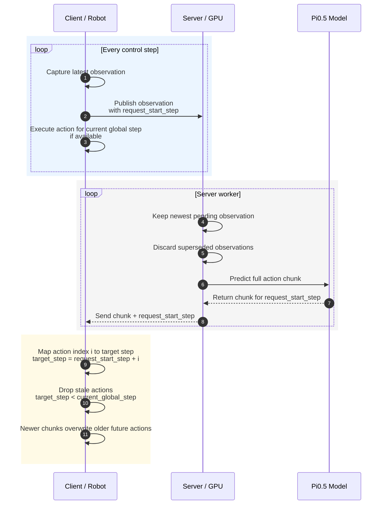

# Inference Pipeline Diagrams

These diagrams show the client-server timing patterns used in the inference
pipeline. They are written in Mermaid so they can be pasted directly into
Markdown slides, GitHub, or a Mermaid renderer.

## FASTER Streaming Pipeline

## Synchronous Inference

## Asynchronous Continuous Inference

## Short Comparison

| Mode | Observation sending | Server response | Client behavior | Main benefit | Main risk |
| --- | --- | --- | --- | --- | --- |
| Synchronous | One observation per chunk | Full chunk after inference completes | Waits, then executes chunk | Simple and stable | Highest waiting latency |
| FASTER streaming | One observation per execution horizon | Partial action deltas as actions become ready | Starts executing ready actions before full chunk finishes | Lower time to first action | Needs careful delay/prefix tuning |
| Continuous async | Observation every control step | Full chunks from newest observations | Drops stale actions and prioritizes newest plans | More reactive to scene changes | Can hesitate if switching chunks too often |

